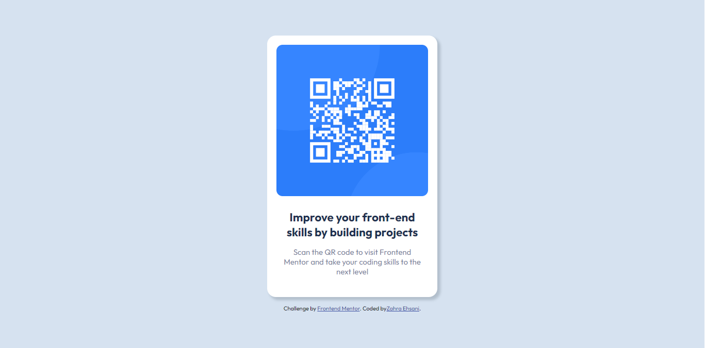

# Frontend Mentor - QR code component solution

This is a solution to the [QR code component challenge on Frontend Mentor](https://www.frontendmentor.io/challenges/qr-code-component-iux_sIO_H). Frontend Mentor challenges help you improve your coding skills by building realistic projects. 

## Table of contents

- [Overview](#overview)
  - [Links](#links)
- [My process](#my-process)
  - [Built with](#built-with)
  - [Why did I code the project again ?](#Why-did-I-code-the-project-again-?)
- [Author](#author)

## Overview

### New

### Old

### Links

## My process

### Built with

- Semantic HTML5 markup
- CSS custom properties
- Flex-box

### Why did I code the project again ?

Well, the first time I coded this project, I actually didn't know much about HTML/CSS.
The presence of unnecessary files, excess in the appearance of the page, and the lack of standard structuring,
It made me decide to rebuild the project.

I realized that in order to show my creativity as a front-end developer, I don't necessarily need to add different and weird designs to the project; Rather, what can make me different from others in this profession is the use of tricks and tips that can have a positive effect on the way of structuring and even improving the efficiency of the project.

## Author

- Frontend Mentor - [@chegudev](https://www.frontendmentor.io/profile/chegudev)
- Github - [chegudev](https://github.com/chegudev)
- Linkedin - [Zahra Ehsani](https://www.linkedin.com/in/chegudev/)
